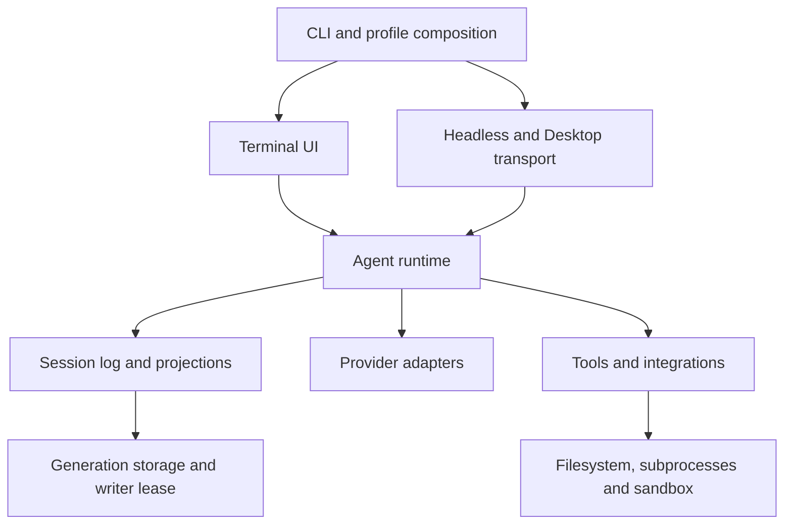

# Bake 0.4 Rust migration roadmap

## Summary

Port Bake's runtime and terminal application to Rust in a sequence of independently reviewable scopes. Keep 0.3.x on bug fixes while the native implementation develops. The target for 0.4.0 is a native default with proven session, tool, provider, terminal, and Desktop compatibility. Later 0.4.x releases can improve performance and features after that baseline is established.

**Status: scopes 00 and 01 in progress, 2026-10-07.** The opt-in [Rust workspace and TUI preview](../../../rust/README.md) provide a runnable native executable, editor, sample-agent views, and platform checks. The preview has no model or tool connection and does not qualify the later terminal scopes. The analysis uses `origin/develop` at `ae5eb51ab61f2266b0fc2ff52f2f14b9f3a9a917`, whose product manifests say 0.3.8. A version in a manifest does not establish release publication. [Codebase analysis](analysis.md) records the source findings; [verification](verification.md) defines the evidence required to close each scope and distinguishes tests run during planning from future tests. Scope 00 tracks inventory, compatibility decisions, and reproducible baseline evidence under `scope-00/`.

## Table of Contents

- [Release lines and change policy](#release-lines-and-change-policy)
- [Target architecture](#target-architecture)
- [Pi agent source reference](pi-reference.md)
- [Durable execution direction](durable-execution.md)
- [Terminal direction](terminal.md)
- [Linear development sequence](#linear-development-sequence)
- [Scope specifications](#scope-specifications)
- [PR and completion rules](#pr-and-completion-rules)
- [Release qualification](#release-qualification)
- [Dev Note](#dev-note)

## Release lines and change policy

The requested product split is 0.3.x maintenance and 0.4.x Rust development. The following implementation policy is proposed; this document does not change branch protection, publication, updater routing, or repository engineering instructions.

| Line | Allowed work | Release condition |
|---|---|---|
| 0.3.x | Reproducible correctness, security, provider-compatibility, installation, and platform fixes; tests and documentation needed for those fixes | Existing Bake gates and release procedure; no new product features bundled with a fix |
| 0.4 development | Additive Rust implementation, compatibility fixtures, migration tooling, and qualification | Explicit development invocation in private test homes; the shipped 0.3 launcher still selects TypeScript |
| 0.4.0 | Native default after every required scope closes | Full compatibility and platform evidence, reviewed upgrade/rollback, and an explicit release request |
| 0.4.x after cutover | Bug fixes and measured improvements to the native implementation | Relevant regression tests and paired evals for model-visible changes |

Start Rust port work on fresh branches from up-to-date `origin/rust/0.4.0`, with PRs against `rust/0.4.0` or a stack on it, as [CONTRIBUTING](../../../CONTRIBUTING.md#the-rust-040-line) describes. That line reaches `develop` through its own merge-commit PR with full CI, and 0.3 fixes come forward from `develop` into it. This integration branch is not the post-0.4 maintenance branch the next paragraph requires. During coexistence, keep Rust in a separate workspace and exclude it from 0.3 release archives and default startup. Each 0.3 fix must add or update a language-independent regression case and identify the Rust scope that must adopt it. Refresh the TypeScript comparison revision deliberately; record changes to the baseline instead of letting it drift silently.

**Concurrent maintenance after 0.4 ships needs a policy change first.** The current `develop` → `main` release flow and single newest-version manifest cannot independently publish both lines. Scope 00 must decide the 0.3 support window and approve a maintenance-branch/channel design before cutover. The recommended design is a protected 0.3 maintenance branch created from the last qualified 0.3 release, dedicated patch PRs and release validation, and an explicit maintenance manifest that cannot replace the 0.4 stable manifest. Implement this through a separate governance/release PR that updates AGENTS, contributing instructions, branch checks, and release scripts together. Until it lands, the existing branch rules apply. Do not invent a maintenance push exception or overwrite `latest.json` with an older version.

Review already-landed, unreleased `develop` work in scope 00: decide which changes belong in the last 0.3 release before declaring the line frozen. This roadmap neither reverts that work nor assumes everything beyond the checked-out release is a bug fix.

## Target architecture

The opt-in implementation uses a Cargo workspace under `rust/`. Bun owns the existing TypeScript workspace and its lockfile; Cargo owns Rust dependencies and `rust/Cargo.lock`. [AGENTS](../../../AGENTS.md#workspace) describes the separate toolchains. No root npm or pnpm lockfile is introduced.

Use a small number of crates organized by ownership, with modules inside them. The names below are proposed responsibilities, not existing packages or a requirement to create every crate immediately.

| Proposed owner | Responsibility | Dependency restriction |
|---|---|---|
| `bake-protocol` | Session envelopes, model messages, tool schemas, Desktop messages, error identities | No terminal, network, or filesystem effects |
| `bake-session` | Session reduction, reconstruction, generations, leases, migrations, queries | Core reduction remains pure; storage adapters own I/O |
| `bake-host` | Processes, filesystem, sandbox, settings, credentials, attachments, spill, terminal leases | Own every acquired resource and its asynchronous shutdown |
| `bake-llm` | Provider routes, authentication, request encoding, streams, retry classification | Depend on host interfaces; never own conversation state |
| `bake-runtime` | Agent state machine, inbox, policies, tools, prompts, compaction, goals, children | One authoritative session and serialized state owner per agent |
| `bake-integrations` | MCP, hooks, web tools, code mode, scheduling, the native plugin API | Use the same tools, permissions, and lifecycle as built-ins |
| `bake-tui` | Editor, layout, transcript presentation, terminal interaction | Read runtime projections; own presentation state only |
| `bake-cli` | Profile selection, headless and Desktop entry points, updater, lifecycle | Compose services and select the frontend |
| `bake-conformance` | Test drivers and comparison reports | Test-only; excluded from shipped archives |

Design the native core around ownership and small typed interfaces. Use Bake's TypeScript implementation and the upstream [DeepSeek Harness](https://github.com/deepseek-ai/deepseek-harness) and [pi](https://github.com/earendil-works/pi) repositories as references for behavior and implementation. Upstream remains read-only; Bake chooses its own Rust crate, module, and composition boundaries. Preserve behavior, released data, model-visible contracts, and the [support decisions](scope-00/support.md#decision-register). An agent task owns inbox transitions and durable event ordering. Bounded concurrent work returns results to that owner; only the owner commits them. Cancellation must stop new work and await owned work. Native extension points must preserve each shipped consumer's ordering, rewrite, delegation, and halt behavior. Qualify the composition mechanism against those consumers. Disposing a Rust object alone is not proof that asynchronous children have stopped.

Historical Session codecs, adjacent migrations, and exact legacy diagnostics belong at the Session import boundary. The core consumes admitted current-format events. Conformance oracles scoped to a TypeScript function qualify that boundary; runtime interfaces follow their consumers and the proofs in each scope.

Candidate foundations are Cargo, Serde, Tokio, and a Ratatui/Crossterm terminal implementation. Cargo supports a shared workspace lockfile; Serde permits explicit wire representations; Tokio documents cancellation followed by waiting for task completion; Ratatui separates rendering from terminal backends. These are starting points for scope 01 and scope 14 experiments, not evidence of Bake compatibility. See the official [Cargo workspace reference](https://doc.rust-lang.org/cargo/reference/workspaces.html), [Serde representation reference](https://serde.rs/enum-representations.html), [Tokio shutdown guide](https://tokio.rs/tokio/topics/shutdown), and [Ratatui backend guide](https://ratatui.rs/concepts/backends/). Pin versions, supported Rust version, platform features, and licenses only after those experiments.

The [terminal direction](terminal.md) keeps the current transcript and composer layout recognizable, with cleaner presentation and clearer agent selection, status, and input focus. Ratatui with Crossterm is the starting stack. The composer uses a pure Bake-owned model following the [editor widget qualification](scope-00/editor-2026-10-07/README.md); the native frontend must pass the inline, Unicode, draft-preservation, and terminal-restoration cases before adoption.

Keep `run_code`'s JavaScript semantics through an explicitly confined embedded engine; moving the host to Rust does not authorize changing the model's programming language. 0.4 ships Rust only, with no bundled or selectable Node/TypeScript compatibility runtime ([D5](scope-00/support.md#decision-register), approved 2026-10-07). The TypeScript runtime stays runnable during development as the comparison oracle; it cannot count as native parity or serve behind a supposedly native profile. Custom JavaScript/Cordis profiles, user executable YAML, custom bundles, and npm profile plugins are excluded from 0.4.0; no profile compatibility loader or migration deliverable is required. Native entry paths must reject them before execution or file changes. 0.4.0 must ship a native plugin API; MCP servers and hook processes alone do not satisfy that requirement ([D6](scope-00/support.md#decision-register), decided 2026-10-07). Electron message ports remain a separate Desktop decision. Scope 00 resolves the shipped support matrix; scopes 05, 12, and 13 prove it.

Use the latest official Pi agent source as an architecture reference for the Rust harness ([D20](scope-00/support.md#decision-register)). [The pinned source review](pi-reference.md) maps its agent loop, session services, provider boundary, and tool lifecycle to Bake scopes. Bake's retained behavior and persistence contracts remain the acceptance target; refreshing the reference does not change them.

Structure the native runtime for durable execution, not only a durable transcript. The [durable execution direction](durable-execution.md) takes Pi Durable's task model as a reference: every model request, tool call, compaction, child agent, and job is an owned task whose unfinished state is derivable from the Session log; tools declare a replay class; one ownership tree governs cancellation, with an explicit foreground/background boundary; and clients attach to the owner's view. These rules stay inside Session format 3 and the 0.3 model surface. Its scope additions and crash-recovery matrix extend scopes 02–13; behavior that would change the model surface or format is listed there as post-0.4.0 candidates.

## Linear development sequence

Complete these scopes in order. Every scope depends on the previous scope's accepted evidence; a useful prototype may occur earlier, but it does not close a later scope. Split a large scope into the ordered PR slices specified below. Do not start another behavior port while the current scope has an unexplained failing required test.

The effort bands are relative: **M** is a bounded subsystem; **L** spans multiple packages; **XL** includes a platform or compatibility redesign. They are not calendar estimates. Re-estimate after scopes 00, 04, 07, and 14 using completed PR throughput and unresolved tests.

| Scope | Deliverable | Band | Exit evidence | State |
|---|---|---|---|---|
| 00 | Approved support decisions and frozen comparison baseline | L | Complete behavior inventory and repeatable TypeScript oracle | In progress |
| 01 | Rust workspace and conformance drivers | M | Native test executable and deliberately failing comparator controls | In progress: workspace, preview, [synthetic comparison harness](../../../conformance/README.md), and [native eval fixture adapter](../../../evals/README.md#native-fixture-adapter); [qualification ledger](ledger/README.md) records partial evidence; three [runtime request fixtures](../../../conformance/README.md#runtime-request-reconstruction) are captured; Rust replay and live native arm remain open |
| 02 | Session types and pure projections | L | Historical replay and reconstructed-request equivalence | Planned |
| 03 | Persistence, migrations, locking, and queries | XL | Cross-runtime reads/writes, crash recovery, writer exclusion | Planned |
| 04 | Host processes and sandbox enforcement | XL | Real denied effects and process-tree quiescence on each OS | Planned |
| 05 | Configuration, composition, credentials, and lifetime ownership | XL | Configuration precedence, scoped cleanup, login/storage parity | Planned |
| 06 | Provider-neutral streaming and failures | L | Stream assembly, cancellation, retry, and usage equivalence | Planned |
| 07 | Provider protocols and authentication | XL | Wire fixtures and route/auth support matrix | Planned |
| 08 | Tool dispatch and local coding tools | XL | Exact schemas/results, permission decisions, external file outcomes | Planned |
| 09 | Agent loop and headless vertical slice | XL | End-to-end edit/resume/cancel and paired agent-loop record | Planned |
| 10 | Context, skills, attachments, and compaction | L | Prompt parity, reconstruction after replacement, long-session eval | Planned |
| 11 | Subagents, goals, background jobs, and schedules | XL | Durable orchestration and race/restart proofs | Planned |
| 12 | MCP, web, hooks, code mode, native plugin API, and extensions | XL | Protocol, permission, VM containment, plugin API design, and extension compatibility | Planned |
| 13 | CLI profiles, public transports, and Bake Desktop | L | Built entry-point and Desktop consumer compatibility | Planned |
| 14 | Terminal engine, layout, and transcript | XL | Inline/fullscreen PTY, Unicode, scrollback, and restoration | Planned |
| 15 | Interactive terminal workflows | XL | Complete shipped PTY scenario mapping and model-surface parity | Planned |
| 16 | Native distribution, update, and rollback | XL | Signed install/update/rollback on all five targets | Planned |
| 17 | Qualification, cutover, and retirement | L | Complete evidence ledger, evals, performance, migration rehearsal | Planned |

## Scope specifications

Each scope below specifies implementation, review order, and observable proof. The [verification contract](verification.md#evidence-required-for-every-scope) applies to every scope, including a negative control, exact commands, platform results, and a rollback boundary. Existing test anchors are starting points for scenario extraction, not a claim that those files cover the whole scope.

### 00 — Support decisions and baseline

**Implement:** inventory every shipped profile, preset, command, tool, provider route/auth flow, configuration form, persisted artifact, and platform. Classify each as native parity, an explicit compatibility adapter, or a proposed support change needing approval. Resolve the 0.3 maintenance channel, old-home aliases, Cordis/plugin support, executable YAML, provider catalogs, Desktop launch integration, and native packaging. Preserve removed-product exclusions and Bake's own Desktop bundle.

**PR order:** support/release decision → inventory and scenario ownership → baseline capture and fixture extraction. Include a measured startup/RSS/shutdown baseline and terminal workloads. Select exact 0.3 release and `develop` commits; compare both where behavior differs.

**Proof:** the baseline rebuilds in a clean checkout; each supported behavior points to a test or an explicitly missing case; every existing test file and PTY scenario has a port/reuse/not-applicable disposition. Produce coverage gaps rather than marking untested cases passed. Resolve policy and compatibility decisions before scope 01 is accepted.

**Rollback:** documentation and test fixtures only; no user configuration or release routing changes until their own reviewed PRs land.

### 01 — Workspace and comparison harness

**Implement:** pinned Rust toolchain, locked dependencies, formatting/lint/test/build jobs, and native test executables. Add a language-independent fixture format and runners for TypeScript and Rust. Adapt the eval runner's launch/composition interface now so later Rust scopes can satisfy the existing eval requirement; it currently assumes a Node CLI and Cordis overlays.

**PR order:** workspace/static checks → shared fixture/comparison driver → native eval-arm support → platform smoke. Keep JavaScript tooling available to test both implementations.

**Proof:** clean locked builds on Linux, macOS, and Windows; matching fixture outputs; deliberate changes to a prompt byte, event order, permission outcome, and final file must each fail the relevant comparator. A fake native arm must pass fixture setup and be rejected when it tampers with an evaluator-owned check file. No live-model success is claimed yet.

**Rollback:** remove the opt-in workspace from invocation; 0.3 startup and packaging remain independently reproducible.

### 02 — Session model and projections

**Implement:** event envelopes, IDs, safe integer limits, message blocks, request headers, tool history, surfaces/replacements, inbox, token/context projections, and fork inheritance. Preserve optional-field omission, null distinctions, JSON constraints, source attribution, and sequence order. Carry retired event vocabulary required by released logs.

**PR order:** wire types/admission → pure reducers → reconstruction/fork/repair semantics. Do not change the Session format solely because the implementation language changes.

**Proof:** all supported historical fixtures reduce to the same logical state and request; unknown required events and unsupported formats fail; explicitly ignorable vocabulary follows the existing rules. Property cases cover sequence gaps, invalid references, duplicate identities, incomplete tool pairs, and replacement coverage. Use [Session tests](../../../packages/core/session/tests/) and [request reconstruction](../../../packages/core/agent-loop/tests/request-reconstruction.spec.ts) as initial oracles.

**Rollback:** pure operations over fixture copies only; production storage is untouched.

### 03 — Durable storage and query

**Implement:** plain and Zstandard JSONL generations, adjacent v0→v1→v2→v3 migrations, independent header/frame rules, atomic publication, crash-tail repair, append/flush ordering, cross-process leases, storage domains, projection caches, attachments' storage interfaces, and session listing/query indexing. Keep exact reads available when full-text search is disabled.

**PR order:** read/migrate → lease/write/flush/recover → query/cache/storage integration. Validate native lock interoperability with TypeScript, not just Rust against itself.

**Proof:** read every frozen generation without editing it; TypeScript writes/Rust resumes and Rust writes/TypeScript resumes at the agreed format, against every release in the scope-00 rollback support set. Equal format numbers alone do not prove compatibility: a required event added within format 3 can still be unknown to an older reader. Test compression tails, corruption, interrupted publication, disk-full/permission failures, competing migrations, and two processes contending for one session. Killing a lock holder permits takeover; a stalled live writer remains protected. Hash original generations before and after each scenario. Begin with [persistence tests](../../../packages/session/session-persistence-jsonl/tests/), including `lease.two-process.spec.ts`, `generation.spec.ts`, and `zstd.compat.spec.ts`.

**Rollback:** discard private candidate homes; shared-home qualification waits for read/write and rollback evidence. A structural format change needs its own adjacent migration and release decision.

### 04 — Filesystem, processes, and sandbox

**Implement:** path handling, atomic private files, environment scrubbing, process spawning, PTYs, process groups/Windows job ownership, timeout outcomes, cancellation, and platform sandbox adapters. Preserve Linux bubblewrap/Landlock, macOS Seatbelt, and Windows restricted-token/ACL semantics, including partial enforcement reporting and unavailable-backend refusal.

**PR order:** filesystem/process ownership → POSIX backends → Windows backend → hostile-operation and teardown integration. Existing native C helpers may remain while independently qualified replacements are evaluated; Rust migration does not require rewriting proven C first.

**Proof:** attempt writes, renames, deletes, symlink/junction escapes, and descendant processes inside and outside permitted roots. Inspect the filesystem and surviving processes. Exercise timeout plus exit 0, output truncation, ignored signals, cancellation during spawn, and repeated shutdown. Never substitute a mocked “denied” result for OS enforcement. Reuse [sandbox scenarios](../../../packages/sandbox/sandbox-local/tests/) and [subprocess scenarios](../../../packages/subprocess/subprocess-local/tests/).

**Rollback:** native execution stays opt-in; no silent unsandboxed fallback. A missing platform backend blocks parity for that platform.

### 05 — Composition, settings, credentials, and lifecycle

**Implement:** scoped ownership of dependencies and contributions, their agent-scoped visibility and availability, ordered extension points, asynchronous close, settings watching, credential precedence, managed secret writes, profile layers, preset configuration, and known legacy names. Define validated native configuration for retained profiles and explicit rejection of custom JavaScript/Cordis profiles, executable YAML, and npm profile plugins ([D5](scope-00/support.md#decision-register)). Their compatibility and migration are outside the release target. For retained native configuration, preserve whole-entry overlay replacement versus field-wise settings merging. Define typed settings for MCP servers and hook processes and a native overlay schema for `--patch`; legacy Cordis compositions remain excluded.

**PR order:** lifecycle/ownership → static configuration and profiles → settings/credentials → unsupported-profile entry-path diagnostics. Detect unsupported constructs before an agent starts, without executing them or rewriting the profile.

**Proof:** layer precedence and reload tests, dependency loss during a call, re-registration without duplicate listeners, partial-startup failure, scoped visibility, canceled secret prompts, secret redaction, file permissions, and old config surviving rollback. Test custom profiles and Cordis user presets through their real entry paths, plus retained profiles with nonempty legacy patch layers: refuse before execution and leave files unchanged. Empty legacy layers must be qualified separately; native MCP and hook configuration must work without Cordis. Anchors: [boot](../../../packages/boot/app-boot/tests/), [credentials](../../../packages/credentials/credentials-local/tests/), [settings](../../../packages/settings/settings-file/tests/), and [presets](../../../packages/preset/agent-presets/tests/).

**Rollback:** preserve original configuration and credential documents; conversions are explicit and independently reversible.

### 06 — Provider-neutral model runtime

**Implement:** immutable prepared calls, message/block assembly, live versus durable streams, finish/failure normalization, token accounting, route metadata, retry scheduling, deadlines, and cancellation. Keep the distinction between provider failures and defects in runtime consumers.

**PR order:** model types/assembly → streamed runtime → retry/default-resolution integration.

**Proof:** fragmented streams, split UTF-8, malformed arguments, premature EOF, abort before/after admission, empty responses, partial reasoning/text, max-token termination, and provider thrown-error versus terminal-error equivalence. Assert one terminal outcome, preserved partial output, correct cache-usage totals, and bounded buffers. Use [LLM tests](../../../packages/llm/llm/tests/) and [retry tests](../../../packages/llm/llm-retry/tests/).

**Rollback:** use the TypeScript adapter oracle; native streams have no live default consumer yet.

### 07 — Provider protocols and authentication

**Implement:** the approved provider matrix, including OpenAI Responses, Chat Completions, Anthropic Messages, DeepSeek compatibility options, configured gateways, catalog-specific transports, model discovery, API-key resolution, and supported OAuth flows. The three generic protocols do not cover every provider that pi-ai currently exposes. Inventory additional catalog protocols and authentication in scope 00; do not silently remove them.

**PR order:** one protocol/route family per PR → replay/reasoning/cache fidelity → discovery/authentication → matrix qualification.

**Proof:** capture sanitized outgoing wire requests and replay provider streams through a local server. Compare schema ordering, model/effort/default resolution, reasoning signatures/replay state, image handling, cache controls, retry headers, stream idle timeouts, and the whitespace-runaway guard. Test proxies, TLS/custom endpoints, credential refresh races, failed refresh, and cancellation during login. Run key-gated smoke tests and paired evals for claimed live routes; mark unavailable credentials as missing evidence. Anchors: [pi-ai tests](../../../packages/llm/llm-pi-ai/tests/).

**Rollback:** keep unqualified routes on the development oracle, visibly outside native support; they block default cutover unless a support change is approved.

### 08 — Tool pipeline and local tools

**Implement:** registry, exact schemas/descriptions, argument validation, timeout policy, approval/permission presets, progress, durable checkpoints, spill limits, and parallel-safe versus exclusive execution. Port read/write/edit, glob/search, bash/PowerShell, persistent shells, file-observation guards, and shell change reporting.

**PR order:** registry/policy → filesystem tools → shell/search tools → parallel scheduling. Preserve ordered result commits even when dispatch finishes out of order.

**Proof:** compare model-visible tool definitions, results, and errors, then independently read changed files. Cover stale edits, binary/large files, paths with spaces, Unicode, permission refusal, queued-call cancellation, exclusive barriers, reclassification, policy halt, and progress arriving during disposal. PTC's nested dispatch later must use this same pipeline. Anchors: [tool runtime](../../../packages/core/tools/tests/), [tool ordering](../../../packages/core/agent-loop/tests/tool-order.spec.ts), [filesystem tools](../../../packages/fs/tool-fs/tests/), and [shell packages](../../../packages/shell/).

**Rollback:** sandboxed private workspaces; no migration of the default tool registry until parity closes.

### 09 — Agent loop and first complete native task

**Implement:** create/resume/dispose, inbox claim/steering/removal, turn/step boundaries, prompt admission after route preparation, request headers, tool loops, retry/repair, cancellation, and a testable headless driver. Wire the native eval arm from scope 01 to the real binary.

**PR order:** lifecycle/inbox → request/stream/tool loop → headless edit/resume → paired evaluation. The first vertical slice must read a file, make a real edit, run its check, exit, and resume its exact session.

**Proof:** run shared transcripts through both runtimes; reconstruct every outgoing request from the committed log. Test cancellation at each admission/dispatch/commit boundary, follow-ups while stopping, max-token dropped calls, pending inbox preservation, tool outcome unknown after a crash, and no effects after dispose. Use [loop tests](../../../packages/core/agent-loop/tests/) and [built headless profile tests](../../../apps/cli/tests/profiles/). Record the standard task suite across both required model sets, three trials, against the clean PR base; additionally compare against the frozen 0.3 oracle.

**Rollback:** TypeScript remains the default entry point; native tasks use disposable homes or verified copies.

### 10 — Context and compaction

**Implement:** system prompt/persona composition, AGENTS discovery, file/session references, skills, runtime context, attachment admission and image variants, tool-result pruning, image offload, manual/automatic compaction, and context-pressure projection. Preserve each preset's defaults and prompt ordering.

**PR order:** instructions/skills/references → attachments → pruning/offload → compaction/checkpoint recovery.

**Proof:** exact first-request snapshots for every supported preset, nested instruction precedence, missing/changed referenced files, image budget failures, cancel during attachment admission, Unicode byte/character limits, and old messages remaining reconstructable after replacement. Test tool-call/result pairing across compaction, failed summary retries, restart after checkpoint, and a prompt queued behind manual compaction. Add the extended long-session eval to the mandatory standard record. Anchors: [context](../../../packages/context/), [attachment](../../../packages/attachment/), [compaction](../../../packages/compaction/), and [model-surface tests](../../../docs/testing.md#pin-the-model-surface).

**Rollback:** copied sessions only until replacements and cross-runtime resume pass; preserve original attachment bytes and generations.

### 11 — Durable orchestration

**Implement:** child creation/control/follow-up, preset and workspace inheritance, route selection/fallback, delegation limits, goals and automatic round continuation, background jobs, scheduled follow-ups, and their projections. Keep cancellation, turn completion, and per-message outcomes distinct.

**PR order:** background jobs → children and routing → goals → schedules/restart.

**Proof:** barriers place child completion before/during/after parent stopping; assert exactly one admitted completion notice, ordered results, no orphan workers, and correct continuation after restart. Cover invalid/slow router replies, denied child permissions, child scope cleanup, goal budgets, schedule clock jumps/time zones, duplicate wakeups, and persisted recurrence. Use [subagent tests](../../../packages/subagent/), [goal tests](../../../packages/goal/), [jobs tests](../../../packages/jobs/), and [schedule tests](../../../packages/schedule/schedule/tests/). Add delegation/background evals where affected, without replacing the standard suite.

**Rollback:** no shared scheduler or shared home between oracle and candidate runs; stop and drain all owned child work.

### 12 — Integrations and extension compatibility

**Implement:** MCP client/resources and reconnection, web search/fetch, hook protocols and external hook processes, code mode, the native plugin API that 0.4.0 requires ([D6](scope-00/support.md#decision-register)), and supported native extensions. Custom JavaScript/Cordis profile compatibility and migration are excluded ([D5](scope-00/support.md#decision-register)). The plugin API's protocol or ABI, contribution set, permissions, lifetimes, and versioning are not chosen; this scope designs them around a named consumer. Account for existing Cordis inspection/mutation and plugin-manager tools ([D7](scope-00/support.md#decision-register)); their generated JavaScript API catalog cannot be presented as a Rust API unchanged.

**PR order:** MCP → web/hooks → embedded code mode → native plugin API → native consumer qualification and catalog generation. Use [Pi's latest MCP source and regression cases](pi-reference.md#native-mcp-direction) as the selected implementation reference, including OAuth cancellation and awaited shutdown; preserve Bake's tool names, resources, policy checks, and logged tool changes. Generate any plugin API catalog from the API's real interface. Regenerate model-facing catalogs from their owner and evaluate intentional prompt/schema changes.

**Proof:** local protocol servers check negotiation, tools/resources, invalid schemas, reconnect, cancellation, and shutdown. HTTP tests cover redirects, DNS rebinding/private destinations, pinned connections, payload limits, and proxy behavior. Code-mode tests cover nested approvals, memory/time exhaustion, infinite loops, denied ambient filesystem/network/process access, output limits, and VM termination. A named consumer exercises the native plugin API through the real native runtime, including version mismatch, denied permission, failure, shutdown, and every other lifetime transition the design defines. Run native fixture plugins through the chosen API, including load/unload/reload/failure; custom Cordis plugin migration is not an acceptance gate. Anchors: [MCP](../../../packages/mcp/), [web](../../../packages/web/), [hooks](../../../packages/hooks/), [code mode](../../../packages/ptc-runtime/), and [extensions](../../../packages/extensions/).

**Rollback:** native execution stays opt-in until the default switch. The TypeScript runtime remains a development oracle that 0.4 does not ship; work that still executes there does not close a native scope.

### 13 — CLI profiles and Desktop

**Implement:** shipped flags, help, errors/exit statuses, exact resume, profile/preset selection, headless JSON output, `bake`/`dsh` aliases, environment compatibility, session navigation/query APIs, and the Desktop protocol. Preserve local feedback, anonymous identity, telemetry opt-outs and explicit-feedback export rules, redacted diagnostics, and bounded exporter shutdown; replace V8-specific watchdog measurements with native measurements. Audit retained `api`, `client`, `host`, and `typert` consumers and either port the required protocol behavior or document an approved replacement before removal.

**PR order:** CLI/headless interface → profile and public transport compatibility → Desktop stdio → Electron launch adapter qualification. Preserve the Desktop protocol's version and byte-identical shared declaration until a coordinated consumer change is approved.

**Proof:** fresh and retained profiles, rejection of excluded custom JavaScript/Cordis profiles, invalid args, missing model, busy session exit 75, redirected output, signal exit, self-check, Desktop ready/init/message/cancel/shutdown, permissions and withdrawn approvals. A local collector must observe no export without the required consent/configuration; opt-outs and an unreachable collector must preserve prompt shutdown. Diagnostics must contain no credentials. Stdio tests alone do not prove Electron utility-process compatibility; run the actual Desktop consumer or its pinned launch harness. Anchors: [CLI tests](../../../apps/cli/tests/) and [Desktop tests](../../../packages/bundle/desktop/tests/).

**Rollback:** preserve the installed alias and legacy launcher contract until the Desktop consumer accepts native spawning or a tested port-to-stdio adapter.

### 14 — Terminal engine and rendering

**Implement:** terminal acquisition/release, inline scrollback, fullscreen viewport, input decoding, grapheme-aware editor, cell measurement, Markdown/tables/code, selection/copy, resize, and authoritative session/live-stream presentation. Follow the [crate selection and composer requirements](terminal.md#rust-crate-selection). Validate the renderer choice against inline behavior early; an alternate-screen demo is insufficient.

**PR order:** terminal lease/input → editor/Unicode → transcript/rendering → fullscreen/mouse/resize. Port observable layout obligations from [layout design](../../../apps/tui/DESIGN-LAYOUT.md); do not translate React components mechanically.

**Proof:** real PTYs and a terminal emulator verify cursor visibility, raw/cooked modes, bracketed paste, autowrap, alternate screen, mouse modes, scrollback preservation, and no duplicate settled blocks. Cover CJK, emoji, combining marks, Thai/Lao, narrow and short terminals, resizing during a stream, plain/no-color output, screen-reader mode, broken pipe, panic, and hangup. Reuse [UI tests](../../../apps/tui/packages/ui/tests/) and [PTY scenarios](../../../apps/tui/scripts/pty-smoke.ts). Add native Windows ConPTY coverage; existing POSIX skips are not Windows proof.

**Rollback:** explicit native frontend selection; every failure path restores terminal ownership before reporting failure.

### 15 — Interactive workflows

**Implement:** completion, history/drafts, slash commands, session picker/navigation, model/effort selection, provider login, permission/settings sheets, approvals/questions, skill invocation, attachments, goals, subagent inspection, update notices, and terminal setup/external-editor handoff. Apply the [agent-handling direction](terminal.md#agent-handling) and its explicit focus, destination, and draft-preservation acceptance cases.

**PR order:** session/composer flows → model/settings/login → human interactions → orchestration/attachments → remaining commands. Keep UI copy centralized and English; render runtime projections for activity, inbox, permissions, and context pressure.

**Proof:** map every existing PTY scenario to a native counterpart with the same externally visible success condition. Test canceled navigation retaining draft/session, canceled login exposing no secret, approval races, queued input and compaction, child inspection without changing parent input, and terminal restoration after an external editor. Pin each preset's model surface and replay persisted sessions. Source anchors: [TUI design](../../../apps/tui/DESIGN.md), [application tests](../../../apps/tui/packages/app/tests/), and the PTY driver. Intentional UI differences require their own reviewed acceptance criteria.

**Rollback:** keep the qualified TypeScript frontend runnable throughout native workflow development.

### 16 — Distribution and updates

**Implement:** native archives for `darwin-arm64`, `darwin-x64`, `linux-arm64`, `linux-x64`, and `win32-x64`; signed manifests; installer/launcher changes; self-check; atomic update/rollback; release retention; and version/channel handling agreed in scope 00. Test old updaters' assumptions about Node entry points and archive layout before changing the layout. The transition route is open ([D14](scope-00/support.md#decision-register)), and it must end in Rust-only shipped artifacts.

**PR order:** package layout and self-check → updater/installers → old-to-new transition/rollback → five-target release rehearsal. Remove the Node prerequisite only after a no-Node host test succeeds; 0.4 archives ship no Node runtime.

**Proof:** install from an empty home, update from the oldest supported updater and latest 0.3, restart/resume, then roll back. Corrupt signatures/hashes, truncated archives, disk-full, concurrent update, held Windows executables, interrupted pointer switching, and failed candidate self-check must preserve the working install. Preserve `dsh --profile desktop` and user-owned aliases. Use ephemeral signing keys in tests. Anchors: [distribution](../../../distribution/README.md), [release tooling](../../../scripts/release/), and [updater](../../../packages/boot/updater/tests/).

**Rollback:** a validated 0.3 executable and its readable data remain available; switching a binary alone does not prove data rollback.

### 17 — Qualification and cutover

**Implement:** close the support matrix, refresh oracle comparisons with intervening 0.3 fixes, run migration rehearsals and performance qualification, switch the default in one reviewable PR, and update owning documentation. Retire TypeScript production code only after checking imports, manifests, YAML composition, generators, platform artifacts, and compatibility consumers.

**PR order:** qualification report → default switch → release preparation → separately reviewed retirement. Keep the TypeScript test oracle and frozen evidence as long as migration verification uses them.

**Proof:** all scope evidence accepted, no unexplained skipped required tests, complete platform matrix, standard/extended model sets with three trials on the standard eval suite, supplemental long-session/delegation cases, and an independently verified edit/test task in both frontends. Repeat install/update/rollback and Desktop tests on final archives. Demonstrate no unexplained regression in startup, first frame, memory, input response, long-session replay, or shutdown using the fixed method in [verification](verification.md#performance-and-soak).

**Rollback:** default-selection revert and tested binary/data rollback. A tag is pushed only on an explicit request to release; completion of this plan does not authorize publication.

## PR and completion rules

Every implementation PR names one scope, one observable result, its base commit, the affected support-matrix entries, and linked evidence. Include the corresponding regression test and owning documentation with the implementation. Model-visible changes require an eval record under the existing [eval policy](../../../evals/README.md); Rust work does not exempt schemas, errors, prompts, or adapter behavior.

Use these states: **Planned → In progress → Evidence review → Complete**. A blocked dependency is recorded with the missing decision/test owner. Do not mark a scope complete because code compiles, a unit suite passes, a demonstration works, or a deadline arrives. Required skips remain missing evidence until the required platform or credentials are available. Record actual commands and failures; preflight rerun warnings are not an unqualified clean run.

During coexistence, run the current Bake gates for affected TypeScript paths and the native gates for affected Rust paths. A terminal behavior change requires the built-profile PTY scenarios. Before a PR, run `bun run preflight` under the current repository policy; scope 01 must integrate native checks into the repository's documented verification path. Preserve hooks and frozen session/eval records.

## Release qualification

0.4.0 is ready for a release request only when all of the following have evidence:

- Every supported 0.3 behavior has native parity or an approved support change with a documented migration path; unresolved provider, plugin, or Desktop gaps block release.
- The native plugin API ships with documented versioning, permissions, and lifetimes, and a named consumer passes against final artifacts ([D6](scope-00/support.md#decision-register)). MCP servers and hook processes alone do not meet this requirement.
- Historical sessions open, current-format sessions resume across both runtimes, concurrent writers remain excluded, and rollback preserves user data.
- All five release targets pass native artifact tests; each OS's sandbox and terminal behavior is tested on that OS.
- Every model-visible change has its required paired record. Regressions are fixed or their measured causes and acceptance are recorded in both the eval note and PR.
- Signing, fresh install, update from 0.3, rollback, aliases, and Desktop launch pass against final archives. Stable and maintenance channels cannot overwrite each other.
- Performance thresholds fixed before candidate measurement pass; no unjoined tasks, orphan processes, leaked terminal modes, or unbounded growth remain in the qualified workloads.
- The 0.3 maintenance owner, support window, fix-forward procedure, and post-cutover release rules are published.

## Dev Note

Scope 00 still owns the remaining compatibility decisions and baseline extraction. Scope 01 has the opt-in workspace, preview, synthetic comparison harness, and a fixture-only native eval adapter with a compiled test arm. The [qualification ledger](ledger/README.md) records partial evidence and failed attempts. Three [runtime request fixtures](../../../conformance/README.md#runtime-request-reconstruction) capture real TypeScript turns: a tool call, a tool added, removed, and restored across turns, and a model request retried under a changed model. Agent resume and a live native model arm remain open. As scope 03 groundwork, development-only Session primitives compare [header records](../../../conformance/README.md#session-header-cases), [source references](../../../conformance/README.md#source-event-seq-cases), [row envelopes](../../../conformance/README.md#row-envelope-cases), [strict V3 codec rows](../../../conformance/README.md#v3-row-cases), and [plain log scans](../../../conformance/README.md#log-scan-cases) with released TypeScript behavior. The plain scan reads uncompressed bytes; a bounded [Zstd reader](../../../conformance/README.md#zstd-log-restoration-cases) restores default-format compressed bytes, including recoverable rows and physical truncation metadata. Neither opens a file; the preview binary's read-only [`session inspect`](../../../rust/README.md#inspect-a-session-log) opens one explicitly named current-format log and prints restoration metadata. Its [lookup form](../../../rust/README.md#look-up-a-session-by-id) finds a Session by id in an explicit root, with the backend's layout, encoding, duplicate, generation, and stored-identity refusals, compared through [shared lookup cases](../../../conformance/README.md#session-lookup-cases) with `open(id, 'read')`; it uses no home default and performs no migration, write, lease, or resume. As early scope 02 groundwork, a development-only [request derivation](../../../conformance/README.md#request-derivation-cases) reproduces the TypeScript `replayRequests` test helper over unseeded, plain current-format logs: the known event types other than `session/end-seed`, refusing `image/offload` as the helper's projection-free Session does, one request per recorded Assistant settlement including failed attempts, the surface appends and replacements Session construction admits, and the latest request header with its tool history. Known log-only records are admitted only as lossless, marker-free JSON. A development-only [plain log restoration](../../../conformance/README.md#plain-log-restoration-cases) reproduces the state the production read path restores from such a log, seeded cuts and interrupted turns included, with the closers that read adds, the `image/offload` message projection, and known `ignorable` rows; some projected numbers and depths, `request/context` and closer coercions, and the projection walk's JavaScript `TypeError` inputs remain native limits. The read-only [`session stat`](../../../rust/README.md#inspect-session-metadata) diagnostic also selects a generation by root and id, translates its v0–v3 header to current metadata, checks identity, and reports physical file size without replaying or migrating events; [shared metadata cases](../../../conformance/README.md#session-metadata-cases) compare it with the TypeScript backend. The read-only [`session list`](../../../rust/README.md#list-stored-sessions) diagnostic discovers materialized Session metadata across an explicit root, with the backend’s header isolation, duplicate detection, and stored-identity checks; [shared listing cases](../../../conformance/README.md#session-listing-cases) compare it with public `list()`. Process-local pending Sessions and cancellation remain outside this diagnostic. A pure [v2→v3 migration](../../../conformance/README.md#v2-to-v3-migration-cases) also translates strict parsed event rows, with shared cases for system-prompt promotion, source admission, reference remapping, seeded cuts, and refusal ordering. It stops before transformed-artifact validation and does not enable historical file reads. The ledger records partial header evidence; the other primitives have no ledger record yet. V3 codec rows borrow mostly unvalidated payloads. Neither they, the derivation, nor the restoration establish Agent resume, migration, file reading, or Session replay outside that subset; the helper itself accepts unknown required event types. As further scope 02 groundwork, a development-only [token-usage fold](../../../conformance/README.md#token-usage-cases) reproduces token-meter's `tokenUsageProjectionDefinition` over a restored log, including same-step replacement and the `llm/retry-started` reset, and refuses inputs whose TypeScript result depends on JavaScript coercion, rounding, or a `TypeError` as native limits. A development-only [inbox and consumed-work fold](../../../conformance/README.md#pending-inbox-and-consumed-work-cases) reproduces the agent loop's restored pending inbox, with its exact seq-tagged splice refusal, and `foldConsumedWork` over a restored log; open compactions and open child agents, which the [durable execution direction](durable-execution.md#scope-additions) also lists as unfinished work, have no pure TypeScript oracle yet. A development-only [fork seed](../../../conformance/README.md#fork-seed-cases) selects the events `SessionStore.fork` copies from a restored Session at an optional boundary, including closers and the appended end seed, and refuses with the TypeScript fork error's exact code and message; it creates no child Session. A development-only [goal projection fold](../../../conformance/README.md#goal-projection-cases) reproduces `applyGoalProjection` over a restored log, including the exact first `goal replay failed at session event N` failure, and refuses fraction, exponent, or -0 count spellings and some unsupported-version diagnostics as native limits. As groundwork for the v0→v1 and v1→v2 migrations, a development-only [released v0 and v1 codec](../../../conformance/README.md#released-v0-and-v1-codec-cases) decodes a released Session's parsed header and rows in strict or recoverable mode, expanding packed Assistant chunk rows, with the frozen codec's exact refusals; it migrates nothing. A development-only [context pressure fold](../../../conformance/README.md#context-pressure-cases) reproduces token-meter's `contextPressureProjectionDefinition`, including the `foldSurfaceProjection` surface-token total with compaction shadow-price claims and its exact replacement error, plus the wire view. Development-only [turn-boundary and title folds](../../../conformance/README.md#turn-boundary-and-title-cases) reproduce `turnBoundaryProjectionDefinition` and `titleProjectionDefinition` over a restored log. A development-only [v0→v1 migration](../../../conformance/README.md#v0-to-v1-migration-cases) runs the released edge over a clean `decode_v0_v1_rows` output, including its legacy rewrites, id state, version-0 payload checks through the now version-parameterized payload semantics, and the delivery-marker check, with the chain's exact refusal messages; the legacy goal-message check remains a native limit. A development-only [v1→v2 transformed stage](../../../conformance/README.md#v1-to-v2-transformed-stage-cases) reproduces `sessionFormatV1ToV2`'s chain stage over a decoded v1 Session, including Assistant chunks grouped into attempts and message streams through a port of `AssistantStreamAccumulator`, legacy interrupted-turn and goal-message rewrites, reference remapping, and seeded end-seed cuts; chunk shapes the accumulator throws on, unchecked casts, and float spellings are native limits, and it is neither production's payload-checked read of a v1 file nor the packed-run path a chain takes. A development-only [v0 history read](../../../conformance/README.md#v0-history-read-cases) runs a decoded released v0 Session through the v0→v1, v1→v2 transformed, and v2→v3 edges and reports the refusal TypeScript's streaming chain reports first; Assistant chunks, events without `time`, a decoded v1 Session, and a v1→v2 refusal that may follow its own emission are native limits. These primitives close no scope. Proposed runtime crates, compatibility adapters, branch/channel changes, and performance budgets require acceptance in their owning scopes. This roadmap provides no calendar commitment.
