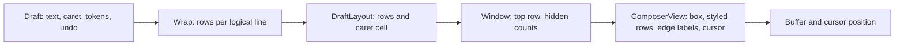

# Native terminal design

## Summary

This page proposes how Bake's Rust terminal frontend looks, behaves, and is built, starting with fullscreen mode. It keeps the shipped TypeScript layout and visual grammar, frames the draft in a rounded box that costs no more rows than the two rules it replaces, makes the composer render dynamically without moving text or the input row, and separates pure presentation from terminal effects so each layer can be tested on its own. It implements the [terminal direction](terminal.md), which owns the acceptance scenarios; the [layout design](../../../apps/tui/DESIGN-LAYOUT.md) and [TUI design](../../../apps/tui/DESIGN.md) remain the oracle for every behavior not listed here as an intentional difference.

Status: proposed. The [Rust preview](../../../rust/README.md) implements the composer box, its wrapping and window, the frame fallback, and [delivery slice 1](#delivery-slices): the crate split, the update function, the key-binding table, and the channel-driven loop. The rest of this page is not implemented. Fullscreen comes first by owner decision; inline scrollback remains a 0.4.0 requirement of [scope 14](README.md#14--terminal-engine-and-rendering), and this design keeps it possible without qualifying it.

## Table of Contents

- [Principles](#principles)
- [Screen anatomy](#screen-anatomy)
- [Intentional differences](#intentional-differences)
- [Composer](#composer)
- [Activity line](#activity-line)
- [Panels above the input](#panels-above-the-input)
- [Layout planner](#layout-planner)
- [Transcript viewport](#transcript-viewport)
- [Code mode](#code-mode)
- [Diffs](#diffs)
- [Syntax colour](#syntax-colour)
- [Architecture](#architecture)
- [Preview status](#preview-status)
- [Delivery slices](#delivery-slices)
- [Verification](#verification)
- [Open decisions](#open-decisions)
- [Dev Note](#dev-note)

## Principles

Every rule below is testable. Each rule names a behavior that a buffer or PTY test can check.

1. **Input comes first.** A key changes the draft and reaches the screen before any runtime, transcript, or measurement work. The input reader never waits on the runtime, and a frame that contains an edit is drawn without waiting for the coalescing interval.
2. **Nothing locks input.** Every panel, sheet, picker, and inspection closes with Esc, and focus returns to where the user opened it. Streaming, replay, and resize never drop or reorder keys.
3. **Things leave the way they came.** Input panels open above the bar and give their rows back to the transcript when they close. A key that opens a sheet also closes it. Leaving a child restores the parent draft, caret, undo history, and reading position.
4. **Every screen answers three questions.** What am I looking at: the bar names the activity and where the session stands. What will Enter do: the placeholder or the box's bottom edge says. How do I get out: Esc always has a named destination.
5. **Motion is restrained.** Only the shimmer across the bar's activity word and its seconds move. Nothing animates on a keystroke. With motion off, under `NO_COLOR`, or with a screen reader, state changes are discrete and the word holds still.
6. **One grammar.** The rail markers, verbs, palette roles, and the "same family, one weight heavier" relation between `›` (a user's words) and `❯` (where the user types) stay as the [layout design](../../../apps/tui/DESIGN-LAYOUT.md#the-composer-is-the-same-family-one-weight-heavier) defines them.

## Screen anatomy

Fullscreen fills the terminal rectangle. The transcript viewport takes every row the controls leave, and the controls rest on the bottom rows in every state. The mockups are illustrative at 80 columns, wrapped as the preview wraps them; `▏` marks the terminal cursor, and product text comes from the copy module.

Every row aligns to four edges:

| Edge | Column | Holds |
|---|---|---|
| Rail | 0 | The prompt mark before the user's words (`>`) and the box's left side |
| Prompt | 2 | The composer's `❯`, `^`, and `v`, and the first cell of every row drawn outside the box: the bar, panels, and standing rows |
| Text | 4 in the box, 2 in the transcript | Draft and prose. A call's state mark sits at 2, its tool name at 4, and its argument in an aligned column after the name; its output, diff, and source start at 4, under the tool name ([D8](#intentional-differences)) |
| Right | last column less 2 | The end of right-aligned keys and hints outside the box, level with the box's inner padding |

Idle, after a turn:

```
> Find where the session controller registers commands

  The registry is the list, so discovery should read it.

  ✓ Bash: rg -n "commands.register" -g '*.ts'  2 lines
    │ packages/app/src/controller.ts:45
    │ packages/app/src/controller.ts:52

  Two registrations, both through ctx.effect.
                                                  PgUp scroll · Ctrl+↑ prompts

  ✓ Completed  42s · read 1    deepseek-v4-flash high  ctx ~12%  ~/bake ⎇ main
╭──────────────────────────────────────────────────────────────────────────────╮
│ ❯ Ask anything · / commands · @ files                                        │
╰──────────────────────────────────────────────────────────────────────────────╯
  Agents  2 · 1 working · 1 done                                          Ctrl+G
  Goal  3/256 · writing tests                                             Ctrl+O
```

Running, with a draft taller than its window; the activity is words alone, the hidden-row count and the mode hint ride the box's edges:

```
  Kneading…  running bash · 12s       deepseek-v4-flash high  ctx ~14%  ⎇ main
╭─────────────────────────────────────────────────────────────────── +2 above ─╮
│ ^ Then thread the value through startup.ts and the session store, and add a  │
│   regression test that sets both DSH_HOME and --home to prove which one      │
│   wins.                                                                      │
│                                                                              │
│   Keep the public API unchanged.▏                                            │
╰───────────────────────────────────────────────────────────── Esc interrupts ─╯
```

Completion open; the panel sits on the bar, nearest the token that opened it:

```
* /changelog  Show what changed in this Bake version
  /model      Choose model and reasoning effort
  /thinking   Change reasoning effort, also during a turn
  +14 more — keep typing to narrow
  ✓ Completed  42s · read 1    deepseek-v4-flash high  ctx ~12%  ~/bake ⎇ main
╭──────────────────────────────────────────────────────────────────────────────╮
│ ❯ /▏                                                                         │
╰────────────────────────────────────────────────────────────────── ↑↓ select ─╯
```

Inspecting a child; the parent draft is kept and shown dim:

```
  explorer                                                     child of main
  Read only · typing never reaches an agent or your draft

  Inspecting  Tab agents · Esc draft                      main: approval waiting
╭──────────────────────────────────────────────────────────────────────────────╮
│ ❯ Then thread the value through startup.ts and the session store, and        │
╰─────────────────────────────────────────────────── draft kept · Esc returns ─╯
  Agents  2 · 1 working · 1 done                                          Ctrl+G
```

## Intentional differences

Each difference from the TypeScript frontend needs its own reviewed acceptance case under [scope 15](README.md#15--interactive-workflows) before release. Everything not listed here is a parity requirement.

| Id | Difference | Reason | Acceptance case |
|---|---|---|---|
| D1 | The composer window holds `clamp(rows / 5, 5, 12)` draft rows instead of five, so it is unchanged below 30 rows | A tall terminal has room to show a long draft; five rows of 60 is cramped editing | Buffer tests at 24, 40, and 60 rows; the transcript keeps at least its minimum rows |
| D2 | The terminal's cursor marks the caret instead of a reverse-video cell | [Terminal direction](terminal.md#composer) requires the cursor at the caret for IME placement; it also follows the user's cursor shape and blink settings | PTY reads the cursor position after every edit and resize; manual IME check on named terminals |
| D3 | Atomic draft tokens are styled: a registered `/command` name bold, an `@path` mention and a paste or image placeholder cyan | The user can see which text the runtime will treat specially before sending it | Buffer styles under truecolor and `NO_COLOR`; the text and caret columns are identical with and without styling |
| D4 | Child inspection shows the kept parent draft, dim, with `draft kept · Esc returns` on the box's bottom edge | Inspection must state where input goes and that the draft is safe ([agent handling](terminal.md#agent-handling)) | The existing inspection case, plus a buffer check that the dim draft matches the parent draft byte for byte |
| D5 | A rounded box frames the draft in place of the two bare rules; rows outside it are inset two cells to align with its contents; hidden-row counts and mode hints sit on its edges instead of a right-hand slot beside the caret | The input reads as one control distinct from the transcript. The box spends the rules' two rows and no more, and hints on the edges take no column from the draft, so a mode change never rewraps it | Buffer tests of the box at every width from 1 to 200, the classic frame, and edge labels that drop whole; PTY resize scenarios |
| D6 | The header's activity is text alone: no spinner glyph for a turn or for compaction. A band of light sweeps across the activity word, and the word list grows from 12 verbs to 32 | Words say what is happening without a symbol a terminal could measure differently, and a larger list keeps consecutive turns distinct | Pure tests pin the sweep, the colour levels, and the word choice; a PTY scenario checks that elapsed time advances without input and that no Braille glyph is drawn |
| D7 | The header and the status line share one row directly above the composer box, the bar: the activity or the last turn's outcome on the left, the status right-aligned. The status is minimal and consolidated into three fields: the model with its thinking level (`deepseek-v4-flash high`), the context reading (`ctx ~11% (15.2k/128k)`), and the location, the directory with its branch (`~/bake ⎇ main`). Git change counts, token totals, the cache hit, and the update notice are not shown, and the goal moves to a standing row under the box | One row says what the session is doing and where it stands, next to where the next prompt is typed, and the box gains a row of transcript. Right-aligned, the status does not move when the activity starts or ends | Pure tests of each field, its tone, and its rank, including the TypeScript `fitStatus` cases; buffer tests that the activity and status share the row and give way in order; a PTY check of the shared row |
| D8 | The transcript and the agent views use blocks and columns instead of the TypeScript verb column. The user's words open with an accent prompt mark, `>`, as they were typed, and the rows a long prompt wraps to hang under the text. A call is one row, `✓ Bash: argument`, its state mark (a green `✓` done, a red `✗` failed, and a white `●` that blinks while it runs, shown and then blank for 600 ms each, the TypeScript `PULSE_MS`, every running mark in phase) at column 2, the tool name bold in the foreground with a colon after it, `Bash:`, in a column wide enough that the arguments of the common four-letter tools align, and its status two cells after the argument: its own, such as `exit 1`, or its line count. Where it does not fit, it takes its own row under the argument and wraps there. A read's or edit's path draws its directory dim, so the row reads by the file name. An edit's output is a numbered [diff](#diffs), and its status counts the lines it added and removed, `+1 -1`. On a truecolor terminal each call, and each script with its program, sits in a box: a soft grey background `#25282f` across the full width, faint red `#2e2225` when it failed, with a blank row between boxes. Inside a box, one padding row opens and closes it and text wraps two cells short of its right edge. The box has two columns: column 2 holds the call's structure, its state mark, a script's gutter mark, and its `console` and `return` labels; column 4 holds what it contains, its output, diff, source, and `⋯` counts, under the tool name. The box groups the call, so it draws no gutter; without a box, a dim `│` at column 2 does. Sixteen colours have no step that subtle and `NO_COLOR` draws none, so neither boxes; a light terminal theme would need a lighter box, which waits for the terminal's background to be queried. Output starts at column 4 under the tool name, hung from a dim `│` gutter at column 2 only where no box is drawn, and a long result's count reads `⋯ 4 more lines`. The standing row reads `Agents  2 · 1 working · 1 done`, without `↳`. The agent list is a column of cards, the selected one marked `▸`, each with its name, its id right-aligned, and one line of what it does; inspection opens with the agent's name and id, then the read-only line. The classic frame swaps every mark for ASCII: `|`, `+`, `x`, `*`, `...`, and `>` | Fewer marks and aligned columns let a long session be scanned by state and tool; the status beside the call answers "what happened" without reading the output, and reads with the call at any width instead of across an empty middle. A code-mode script reads as one such block, headed `Codemode`: its numbered source, each call site under the line that makes its calls ([code mode](#code-mode)). Every mark comes from the frame's glyph set, so a terminal that cannot measure the round glyphs gets ASCII | Pure tests of each row's lines at fixed widths, in both glyph sets; buffer tests of the list and inspection; PTY checks of the new rows |
| D9 | The preview borrows a printed catalogue's vocabulary. Short codes are tags: an exit code or interruption after its call (` exit 0 ` green, ` exit 1 ` red, ` interrupted ` yellow) and an agent's id (blue), each a cell of padding on each side on a dark tint of its tone. The welcome title carries the palette as a swatch strip, hues then greys. A dim dotted rule, `┄`, opens each user turn. Inspection is a ledger: the agent's name, a dotted rule, then label and value rows (`Id`, `Role`, `State`, `Input`, `Draft`) with the values in one column. The bar is a breadcrumb while inspecting, `Agents / Sample explorer` | A tag lets the codes that answer "did it work" and "which one" be found at a glance without colouring whole rows; a ledger reads a record's fields down one column; the rule marks where each turn starts when scrolling back. The tag's padding keeps its width without colour, and the strip is left out where a block glyph might be measured wrongly | Pure tests of the tag's tones, width, and fallbacks, the rule, and the strip's conditions; buffer tests of the ledger, its alignment, and the breadcrumb; PTY checks of the inspected view |

## Composer

The composer is a box around the draft: a prompt marker, the draft, and two edges that carry the window's hidden-row counts and the mode's hint. It changes height with its content and changes words with the session's mode, while its text, caret, and bottom edge stay where the user expects them.

### Shape

The box replaces the two rules that frame the TypeScript composer, so it costs the same rows. Its geometry depends on the terminal width alone, so a change in height never rewraps the draft.

- **12 columns or wider:** `│ ❯ text… │`. The left side, a padding cell, the prompt, and a space take four cells; a padding cell and the right side take two. The right padding cell is the caret's column, so a full row of text never wraps for the caret.
- **Narrower than 12 columns:** no sides. The edges are plain rules, the prompt takes two cells when the width exceeds three, and the last column is the caret's.
- **Short terminals:** the box closes only when both edges have rows. With one edge, that edge is a plain rule. The text keeps its columns either way.

The frame is chosen once, before the first frame, by the same rules as `resolveFrame`: a terminal without a UTF-8 locale, with no `TERM` or `TERM=dumb`, or with a Chinese, Japanese, or Korean character locale gets `+`, `-`, `|`, and a `>` prompt, because a full-width run of box-drawing characters drawn wider than measured wraps and breaks every row below it. Windows Terminal's `WT_SESSION` stands in for the locale and `TERM`.

Edge labels are dim and sit near the right end, with at least one rule cell on each side. The top edge carries `+N above`. The bottom edge carries `+N below`, or else the mode's hint. A label that does not fit is left out whole; the rail's `^` and `v` still mark hidden rows.

### Pipeline

Each stage is a pure function of the previous stage and the frame width. Only the last step touches a Ratatui buffer.



- **Wrap per logical line.** A visual row never crosses a line break, so each logical line wraps on its own. The wrap cache keys each line by its content revision and the draft width. An edit invalidates only the lines it touched, and a resize invalidates all of them. The preview wraps the whole draft each frame; the cache is planned.
- **The layout ignores the caret.** The row count depends only on the text and the width, never on where the caret is. Wrapping uses one column less than the row, and the caret takes that last column only after a row's text or over hanging whitespace, as the [composer rules](../../../apps/tui/DESIGN-LAYOUT.md#26-composer--a-cursor-following-window) require. Moving the caret therefore never moves a word or changes the composer's height.
- **Only visible rows are styled.** The view builds spans for the rows in the window. Rows above and below contribute only their counts.

### Wrapping

Wrapping follows `wrapDraft` exactly: rows break after spaces and tabs; whitespace at a break hangs past the row; wide characters are break opportunities of their own; Thai, Lao, Khmer, and Myanmar use dictionary word boundaries; a word longer than a row splits only between graphemes; and a tab advances to the next four-column stop. Wrapping, the caret, mouse clicks, and selection share one cell-width function, which delegates to the measure that Ratatui's buffer uses.

Hints and counts sit on the box's edges, never beside the draft, so the draft's width depends on the terminal width alone. A mode change, an opened menu, or a hidden-row count never rewraps the draft.

### Window

The window holds the visible rows. Its top row is presentation state that persists between frames. The first frame puts the caret on the window's bottom row. After that, the window moves only when the caret would leave it: typing at the end keeps the caret on the bottom row, and moving up inside a tall draft moves the caret up the window before the text scrolls. A width change renumbers the rows, so after a resize the caret keeps the window row it had, as far as the new layout allows. A shrinking draft never leaves blank rows under it while rows above are hidden.

A draft taller than the window marks what it hides. A dim `^` in the prompt column of the first visible row means rows above, and a dim `v` in the prompt column of the last row means rows below. The prompt marker stays on the draft's first row. The box's edges count the hidden rows: `+N above` and `+N below`.

### Height

The composer's height is `min(draft rows, window maximum)`, and the [planner](#layout-planner) grants it before any panel above the input. Growth takes rows from the transcript viewport, never from the controls below the composer, so the bottom edge and standing rows never move.

- **While following output,** the viewport stays anchored at its bottom, so a growing composer pushes the transcript up, in the same direction new output moves.
- **While reading history,** the viewport's anchor is at its top, so a growing composer covers the bottom of the viewport and the passage being read does not move.
- **When the draft shrinks,** freed rows return to the viewport in the same frame.

### Modes

The composer renders from the session's mode. The editor, the wrapping, and the window are the same in every mode; only the prompt style, placeholder, bottom-edge hint, and the meaning of Enter change.

| Mode | Prompt | Empty placeholder | Bottom edge | Enter |
|---|---|---|---|---|
| Idle | `❯` cyan | `Ask anything · / commands · @ files` | `Enter sends` while editing | Starts a turn |
| Running | `❯` cyan | `Enter steers the next step · Alt+↑ sends now` | `Esc interrupts` | Steers the next step |
| Compacting | `❯` cyan | `Compacting… Enter queues · Esc cancels` | none | Queues a turn |
| Completion open | `❯` cyan | n/a | `↑↓ select` | Selects the highlighted choice |
| Inspecting a child | `❯` dim | the kept parent draft, dim | `draft kept · Esc returns` | Explains that inspection is read-only |
| Masked sign-in field | `❯` cyan | the field's prompt | the field's hint | Submits the field |

The placeholder's parts after the first drop whole when they do not fit, and the idle placeholder drops them below 60 columns, as the [width rules](../../../apps/tui/DESIGN-LAYOUT.md#the-composer-yields-structure-before-it-yields-content) require. A hidden-row count takes the bottom edge before the hint does. A question's free-text answer and the sign-in field reuse the same editor and view with their own drafts and no history. A masked field draws each grapheme as `•`, and word motion treats the line as one word.

### Tokens

Paste placeholders, image placeholders, and completed mentions are atomic spans the draft records by byte range and identity. Motion and deletion treat a span as one grapheme. Deleting an image placeholder emits an unstage effect, and neither undo nor yank restores it; a text placeholder stays registered for both, as [the input contract](../../../apps/tui/DESIGN.md#5-input-flow) requires. Styling (D3) never changes a span's cell width.

## Activity line

The bar above the box says what the session is doing in words alone, at the prompt column, with the status line right-aligned beside it ([D7](#intentional-differences)): the turn's word with an ellipsis, then its phase and elapsed time, dim. `Kneading…  running bash · 12s`. No glyph stands beside it, so the row has no symbol whose width a terminal could measure differently.

- **Words.** One verb is chosen per turn by the TypeScript `activityWord` hash of a seed fixed for the turn, from 32 baking verbs: the 12 the TypeScript copy names and 20 more. Each names active work. None says the turn is resting or done, and `Laminating` stays with compaction.
- **Phase and time.** The phase follows `phaseOf` (`thinking`, `writing`, `running <tool> +N`), and elapsed time reads `8s` or `1m 05s`. On a narrow bar the phase and time give way first, then status fields by their ranks, then the status line whole; the word is never cut for them.
- **Shimmer.** A band of light three graphemes wide sweeps across the word, left to right, one grapheme every 70 ms, then the word rests unlit for twelve beats. On a truecolor terminal (`COLORTERM` of `truecolor` or `24bit`) the band blends from the running orange `#f97316` to the palette's glint `#fff7ed`. Otherwise it steps through yellow, light yellow, and bold bright white. The phase and time never shimmer.
- **Motion off.** Under `NO_COLOR` the word is bold in the terminal's foreground and holds still, and only the seconds change, once a second. Under a screen reader the line changes only when its words do.
- **Compaction.** `Compacting history…` takes the same row in the compacting blue `#3b82f6`, its band blending toward `#dbeafe` (blue, light blue, and bright white without truecolor), and returns to the turn's word when compaction settles.
- **Redraws.** The line changes on each shimmer beat, or on each second with motion off. The event loop wakes for that deadline and nothing else; Ratatui's buffer diff writes only the cells that changed.

## Panels above the input

Input panels belong to the input, not to the conversation. They stack between the blank row that opens the controls and the bar, in the TypeScript order, top to bottom:

1. Pending input
2. Staged attachments
3. Sending notice
4. Interaction (approval or question)
5. Running command
6. Notice
7. Quit feedback
8. Completion
9. Command usage

Completion is lowest, so it sits next to the token that opened it. Every panel that lists a source of unbounded length uses a [derived item limit](../../../apps/tui/DESIGN-LAYOUT.md#the-item-limit-is-derived-never-constant) and the `+N more` form. An interaction never yields; when it cannot fit beside the composer, it replaces the controls, as it does today.

## Layout planner

One pure function turns the terminal size and the presentation state into row counts for every region. Regions claim rows in the order below; on a short terminal, the last claimant yields first. The input's first row is always granted.

| Claim order | Region | Rows |
|---|---|---|
| 1 | Composer, first row | 1 |
| 2 | Bar: activity and status | 1 |
| 3 | Interaction | Its need; never yields |
| 4 | Box top edge, then bottom edge | 1 each |
| 5 | Subagents row, goal row, then background row | 1 each, while present |
| 6 | Gap above the controls | 1 |
| 7 | Further draft rows | Up to the window maximum, keeping the transcript's minimum |
| 8 | Quit feedback, completion, usage, pending, attachments, command, notice | Each its derived limit |
| 9 | Transcript hint row | 1 |
| 10 | Transcript viewport | The rest |

This order follows the TypeScript collapse: gap, bottom edge, top edge, and then the bar give way before the input. The bar holds both the TypeScript header and status line, so they go together. Claiming the edges together means a short terminal loses the open edge first, and the box closes only when both edges have rows. A width change never changes a row count by itself, because every chrome row is one row at any width.

## Transcript viewport

Fullscreen's transcript is a viewport over immutable committed batches and the current live rows, as [the fullscreen design](../../../apps/tui/DESIGN-LAYOUT.md#21a-fullscreen-transcript) describes. The Rust viewport keeps the same obligations:

- **Bounded work.** A row is presented only when visited, with at most 32 cached presentations, keyed by row identity, width, and presentation policy. Following output measures from the newest row up; reading measures from the anchor down. Neither mode measures the whole history.
- **One reading anchor.** The anchor is a row identity, a character offset, and a line within the row. It holds through appends, composer growth, resize, and the conversion of a streamed row into committed fragments.
- **Same keys.** PgUp and PgDn move a viewport less four rows. Ctrl+↑ and Ctrl+↓ jump between prompts. Ctrl+Home goes to the beginning, and Ctrl+End follows output. The mouse wheel uses the TypeScript acceleration. Open sheets and interactions receive navigation keys first.
- **No duplicate output.** A settled answer block appears once, whether it is still live or already committed.

The viewport's last column is its scrollbar. It is reserved even while the history fits, so text never reflows when the bar appears. The thumb is a heavy `┃` on a thin `│` track, grey `#9ca3af` on `#374151`, and cyan while dragged; under `NO_COLOR` it is bold on dim, and the classic frame draws `#` on `|`. Its length is the visible share of the history, at least one row, and it rests at the foot while following. Pressing the track puts the thumb's middle under the pointer, and a drag follows the pointer until release, wherever the pointer goes. The scroll indicator takes the gap row just above the controls, so it reads with the bar and the box rather than over the text; the planner grants that row before any viewport row, so a viewport always has one under it, and a notice sits between the indicator and the bar. While following, it holds the scroll keys right-aligned and dim. While reading, it holds a pill centred under the text, the scrollbar's column excluded: `↓ 12 lines below · Ctrl+End`, sky `#7dd3fc` on the box's grey; once rows arrive below, `↓ New output · 16 lines below · Ctrl+End`, yellow `#fde68a` on `#3a3416`, as the TypeScript `↓ New output` offer does. Narrow, it drops the key, then the count. Pressing it follows output. The scrollbar needs the whole history's height: each row is measured once per width and look, and again only when appended or changed.

The mouse is on in fullscreen, with the TypeScript modes: presses, releases, and the wheel (1000), motion while a button is held (1002), and SGR coordinates (1006); never any-motion (1003). The wheel follows the TypeScript `WheelSteps`: one row for a lone notch, up to six a notch in a fast spin, one row a report on a local macOS terminal, and Alt five times as far. The input thread timestamps each report on the loop's clock, so reports applied in one batch keep their real gaps. In the agent list the wheel steps the selection.

## Code mode

A `run_code` call, a program the model writes in TypeScript and runs in the confined QuickJS VM, is one transcript block like any call ([D8](#intentional-differences)), headed `Codemode`. It is drawn as the program it is, not as a batch of tool calls: the source is the body, each call site hangs under the line that makes its calls, and what went back to the model follows, apart. Only that last part re-enters the model's context; the calls stay on the harness side, which is the point of code mode.

```
  {} Codemode: Read every manifest, then build  14 calls · 1 failed
  │ 1  const paths = await tools.glob({ pattern: "packages/*/package.json" });
  │    ╰ ✓ tools.glob  packages/*/package.json  12 files
  │ 2  const texts = await Promise.all(
  │ 3    paths.map((path) => tools.read({ path }).catch(() => "")),
  │    ╰ ✓ tools.read ×12  ━━━━━━━✗━━━━  11 done · 1 failed
  │      ✗ packages/goal/package.json  Permission denied
  │ 4  );
  │ 5  console.log(`read ${texts.filter(Boolean).length} of ${paths.length}`);
  │ 6  const { exitCode } = await tools.bash({ command: "bun run build" });
  │    ╰ ✓ tools.bash  bun run build   exit 0
  │ 7  return { manifests: paths.length, exitCode };

  console  read 11 of 12
  return   { manifests: 12, exitCode: 0 }
```

- **Head.** The script's own state mark, braces, `{}`, for the program it is: green done, red failed, white and blinking while it runs, two cells wide, so `Codemode` starts a cell after a call's tool name. Its call sites and every other call keep the state marks `✓`, `✗`, and `●`. Under `NO_COLOR` or with the classic frame colour cannot tell the states apart, so the head takes a call's mark. Then `Codemode` and its description, then how many calls it made; while it runs, how many are in flight, `13 calls · 9 running`; once it has ended, how many failed, in red; and its own status, such as an ` interrupted ` tag.
- **Program.** Numbered from 1, the numbers dim, the code syntax-coloured with its indentation kept. Up to thirteen lines read whole. A longer program keeps its first two and last two lines and every line a call site hangs from, and counts each run of the rest as `⋯ N more lines`; the numbers keep their place. While the script runs, the gutter of a line whose calls are in flight carries an accent `▸` in place of its rule, so the reader sees where the program is.
- **Call sites.** The calls a program made through one binding are one site, drawn under the first source line that names the binding, `╰` at the code column. The session log records which tool a call reached but not which line made it, so a binding named on several lines is drawn at the first, and calls through a binding no line names, as a computed `tools[name]` would be, hang after the source. A binding reads as the program wrote it, `tools.read`, or `tools["my-tool"]` for a name that is not an identifier, `tools.` dim and the name bold. A site of one call reads `╰ ✓ tools.glob  argument  note`, the note a size, an exit tag, or its error in red. A site of several, the fan-out code mode exists for, reads `╰ ✓ tools.read ×12`, then a meter with a cell per call in the order they were made, `━` green when done, `╌` dim while running, `✗` red when failed, `╳` yellow when an interruption stopped it (`=`, `-`, `x`, `/` with the classic frame), then a tally, `11 done · 1 failed`. The meter is drawn for up to 24 calls when it fits; the tally moves under the label when it does not fit beside it. Up to three failures are listed under the site with their errors, and the rest counted, `⋯ 2 more failed`. A call that succeeded never shows its output, because the program consumed it and the model never saw it.
- **Back to the model.** After a blank row, labelled in the program's own terms: `console` before the lines it logged, in the output tone and previewed like any output, then `return` before the value it returned, coloured as TypeScript, or `error` before how it failed, in red. Nothing is drawn here while the script runs, because the runtime hands both back together.
- **Interrupted.** Calls in flight end `interrupted`, counted in yellow on their site, and calls not yet started never appear. The site's mark is a failure and the head carries an ` interrupted ` tag, but stopped calls are not counted or listed as failures, so a failure of the program's own stays in view. Lines the program logged before it stopped are kept.
- **Classic frame.** `` ` `` opens a call site and `>` marks the line in flight.

The preview's sample session holds one finished script, and Ctrl+T runs a live one on a fixed timeline. These remain: approvals raised by a script's calls, and the session log as the source of the calls.

## Diffs

An edit's output is a numbered diff, styled after [Diffs](https://diffs.com/): line numbers, a coloured bar beside each changed line, the changed part of a line under a stronger tint, and a count of the lines between hunks. It is side by side when the call's text area is at least 100 cells wide, so each side keeps about 46 cells, and unified below that; a resize switches between them on the next frame.

```
  ✓ Edit: src/parser.ts  +1 -1
       ⋯ 40 unmodified lines
    41     const fields = split(line);                  │ 41     const fields = split(line);
    42 ▎   if (quote) fields.push(rest);                │ 42 ▎   if (quote) throw new SyntaxError("unterminated
                                                        │    ▎ quote");
    43     return fields;                               │ 43     return fields;
```

- **Numbers.** Hunk headers, `@@ -41,4 +41,4 @@`, set them; lines before the first header count from 1. Unified shows the old file's number on a removed line and the new file's otherwise; side by side, each side shows its own. Numbers are right-aligned to the widest, dim on context and in the change's colour on a changed line.
- **Skipped lines.** The lines before a hunk read `⋯ N unmodified lines`, across both sides. Past 16 rows the rest fold into `⋯ N more lines`.
- **Marks.** A changed line has a bar, `▎`, red removed and green added. Where colour cannot tell them apart, under `NO_COLOR` or with the classic frame, the marks are `-` and `+`.
- **Changed part.** A removed line and the added line it pairs with are compared by the text they share at their start and end; the differing middle takes a stronger tint, `#6b2f37` removed and `#2a5e3f` added, over the line's tint, `#3d2529` and `#213a2c`. Lines that share only whitespace changed whole and take no stronger tint. Without a box, a changed line takes its colour whole and the changed part is bold.
- **Pairing.** Side by side, a context line is on both sides, and a run of removed lines sits beside the run of added lines that follows it; a line with no partner leaves the other side blank.
- **Wrapping.** Code wraps under itself, never truncates, and its wrapped rows keep the bar. A row is as tall as its taller side, and the shorter side keeps its tint down the row.
- **Colour.** Code keeps its syntax colour on every line. Each side is lexed on its own, as the two versions of the file.

## Syntax colour

Colour marks code, so it is used only where the transcript shows code in a known language, and every other row stays in the output tone. A lexer splits each line into tokens without changing a byte, so colour cannot change a cell width or a wrap; a token a wrap splits keeps its colour on every row.

| Where | Language | Notes |
|---|---|---|
| A code-mode script's source | TypeScript | Lexed in order across every line, so a block comment or template string that opens on a folded line still colours the lines shown after it |
| What a script returned | TypeScript | A JavaScript value; a failed script's error stays red |
| A shell call's command | Shell | The program, its flags, strings, variables, and operators |
| An edit's diff | From the file's extension | TypeScript and JavaScript, Rust, or shell; any other file is plain. Side by side, each side is lexed on its own, as the two versions of the file |
| A shell call's output | Its command's own look | A search's `path:line:` (path magenta `#f0abfc`, numbers green `#86efac`), a test runner's markers and counts (pass green, fail red `#f87171` and bold, skip yellow, zero counts and timings dim), `git status --short` codes, and `error:` or `warning:` labels from any command. Bake runs commands with `NO_COLOR=1` and `TERM=dumb`, so the look is recognised from the output's shape; output that carries SGR colour keeps it instead, mapped to sixteen colours on an ANSI terminal and dropped under `NO_COLOR`. Every escape and control character is removed from all tool output, as the TypeScript `toolText` strips ANSI |
| Other tools' output, answers, reasoning | none | Not code in a known language |

| Token | Colour | Sixteen colours |
|---|---|---|
| Keyword, shell operator | violet `#c4b5fd` | magenta |
| String | lime `#bef264` | green |
| Number, constant (`true`, `null`), shell variable | orange `#fdba74` | yellow |
| Called name, shell program | sky `#7dd3fc` | cyan |
| Comment | dim italic | dim italic |
| Shell flag | dim | dim |

Under `NO_COLOR` only the dim and italic remain. How a diff marks its lines is in [Diffs](#diffs). These lexers are deliberately small; a grammar-based highlighter for more languages waits on a dependency decision.

## Architecture

The design mirrors the TypeScript split between a pure presentation package and an application that owns effects. Its crate names follow the roadmap's [target architecture](README.md#target-architecture).

### Crates

| Crate | Owns | May depend on |
|---|---|---|
| `bake-tui-view` | Editor, presentation state and its update function, key bindings, view models, layout planner, widgets, palette, frame glyphs, and English copy | `ratatui-core`, `unicode-segmentation`, `unicode-width`; no Crossterm, I/O, threads, or clock reads |
| `bake-tui` | Terminal lease, input decoding, output, signals, the event loop, and the runtime port | `bake-tui-view`, `ratatui`, Crossterm, `signal-hook` |

The crate boundary makes purity a compile-time fact: `bake-tui-view` cannot reach the terminal because it does not link Crossterm. `ratatui-core` already appears in `rust/Cargo.lock` at the pinned Ratatui version, so the split adds no new third-party crate. Terminal leases move to `bake-host` when that crate exists.

### State and updates

The view crate receives every input as data, applies it, and returns effects; it never performs them.

```rust
/// Everything the frontend applies, in arrival order.
pub enum Msg {
    Key(KeyInput),          // Bake's own key type, decoded from Crossterm by bake-tui
    Paste(String),
    Mouse(MouseInput),
    Resize { cols: u16, rows: u16 },
    Tick(Duration),         // time since the loop started; the view reads no clock
    Runtime(RuntimeUpdate), // committed batch, live frame, status, projection change, request opened or closed
}

/// Requests the terminal owner performs on the view's behalf.
pub enum Effect {
    Submit(Submission),     // follow-up, steer, or queue, chosen from the agent's status
    Cancel(AgentId),
    Answer(RequestId, Answer),
    Query(QueryId, Query),  // completion and file discovery; stale answers are dropped by id
    Unstage(AttachmentId),
    Quit,
}

pub fn update(state: &mut State, msg: Msg) -> Vec<Effect>;
pub fn render(state: &mut State, frame: &mut Frame);
```

`render` changes only the composer window, because the rows the frame grants the composer decide where the window follows the caret. `State` holds presentation state only: drafts, focus, open sheets, window and viewport positions, completion selection, notices, and the quit timer's deadline. Agent status, inboxes, permissions, context pressure, goals, and the transcript stay with their runtime owners and arrive through `RuntimeUpdate`, following the [one-authority rule](../../../apps/tui/DESIGN.md#3b-one-authority-per-fact). Key bindings live in one table that maps a focus and a `KeyInput` to an action, so Bake, not a widget, owns every shortcut.

### Event loop

The UI thread owns `State` and the terminal. Other threads only send messages to it.

- **Sources.** A reader thread waits on Crossterm input and sends decoded messages. It wakes every 50 ms only to check whether to stop, so shutdown can join it before raw mode ends; a blocking read could not be interrupted, and it would hold Crossterm's reader lock against any query the UI thread makes. The runtime sends updates through the runtime port. A signal thread forwards SIGINT, SIGTERM, and SIGHUP. The UI thread never polls.
- **Batching.** The loop waits for the next message or the next deadline: a shimmer beat, an elapsed-second change, the quit timer, or a pending frame. It then applies a `Tick` and every waiting message in order, up to 256, and draws once.
- **Frame policy.** A batch that contains input is drawn at once. A batch of runtime updates alone is drawn at most once every 16 ms. The activity line is redrawn on each shimmer beat, or each second with motion off.
- **Output.** Every frame is written between synchronized-update markers (DEC mode 2026), and Ratatui's buffer diff writes only changed cells. A slow terminal blocks only the UI thread; the reader thread keeps queueing keys, and the next batch applies all of them.
- **Debris.** While the lease is held, nothing else writes to stdout or stderr. Diagnostics go to a file sink, and captured messages appear as notices, as [the debris rules](../../../apps/tui/DESIGN-LAYOUT.md#83-debris--someone-else-writes-to-the-terminal) require.

### Runtime port

`bake-tui` reaches the agent runtime through one port that accepts effects and produces `RuntimeUpdate` messages. Until the native runtime exists, a fixture port replays synthetic sessions and answers effects from a script. That lets the transcript, panels, and modes be built and tested before scope 09 without connecting a model. The fixture port is development tooling and does not count toward native parity.

### Terminal ownership

`TerminalSession` keeps its contract: it records each mode before requesting it and restores exactly those modes in reverse order on every exit path. It turns autowrap off, so a row the terminal draws wider than measured is clipped instead of scrolling the fixed screen, and it records an open synchronized update so a failure mid-frame still ends it. Fullscreen adds mouse reporting (SGR modes 1000, 1002, and 1006). Keyboard-enhancement protocols stay off until they pass their own terminal qualification.

### Room for inline mode

Fullscreen-first must not block inline mode. These rules keep the views independent of the screen mode:

- Row presentation produces lines at a width and knows nothing about the screen mode.
- The planner takes the screen mode as an input, so inline mode can add its held-height and cursor-row rules.
- Committed rows are immutable and identified, so an inline writer can print each row exactly once.

Qualifying a renderer for inline mode remains open work; this page does not choose between Ratatui's inline viewport and a Bake-owned writer.

## Preview status

The [Rust preview](../../../rust/README.md) implements the [composer shape](#shape), `wrapDraft`'s wrapping without dictionary word boundaries, the caret-independent layout, the persistent window with hidden-row counts on the edges, D1's window height, the notice above the header, the frame fallback, the text [activity line](#activity-line) with its shimmer, for a sample turn and a sample compaction that Ctrl+T steps through, the [modes table](#modes) for idle, running, compacting, and inspection, the [layout planner](#layout-planner)'s claim order for the regions the preview has, the bar that shares the activity with the consolidated status, status fitting by rank, a sample turn's outcome held on the bar, standing-row keys that give way below 60 columns, batched input with one synchronized repaint per batch, and autowrap turned off while it owns the screen. These gaps from the oracle remain:

| Preview behavior | Oracle behavior | Source |
|---|---|---|
| Tab opens the sample-agent list | Tab accepts completion; Ctrl+G opens the subagent sheet, and Down from an empty composer selects the subagents row | `keys.rs`, `BINDINGS` |
| A word in Thai, Lao, Khmer, or Myanmar splits between graphemes | Those scripts break at dictionary word boundaries | `editor.rs`, `layout` |
| The caret is the terminal cursor | D2 proposes the same; the oracle draws a reverse-video cell | `render.rs`, `render` |
| Every wake draws a frame | A batch of runtime updates alone draws at most every 16 ms | `terminal.rs`, `run_loop`; there is no runtime port yet |
| The idle placeholder names editing keys: `Type a draft · Alt+Enter newline · Ctrl+Z undo` | `Ask anything · / commands · @ files` | `copy.rs`, `PLACEHOLDER`; the preview has no commands or file mentions |
| Enter shows the no-model notice in every mode, and Alt+↑ does nothing | Enter starts, steers, or queues a turn by mode; Alt+↑ sends steering now | `state.rs`, `composer_key`; there is no runtime port yet |
| The status line reads `no model`, the branch, and the directory | It also names the model, thinking level, and context occupancy | `status.rs`, `fields`; those readings need a runtime |
| The transcript is a fixed sample; nothing streams | Committed batches and live rows from the runtime | `transcript.rs`, `sample_session`; there is no runtime port yet |
| The reading anchor is a row and a line, clamped inside its row after a width change | A row identity, a character offset, and a line, so a width change keeps the same character at the top | `transcript.rs`, `Anchor` |
| Every visited row is presented again on each frame | At most 32 cached presentations, keyed by row identity, width, and policy | `transcript.rs`, `Transcript::lines` |
| There is no goal row | The goal has its own standing row under the box ([D7](#intentional-differences)) | `render.rs`; goals arrive with the runtime |
| The completion and masked sign-in modes do not exist | Each has its own row in the modes table | `mode.rs`, `Mode`; they arrive with completion and sign-in |

## Delivery slices

These slices are ordered PRs inside [scope 14](README.md#14--terminal-engine-and-rendering). Each keeps `bun run dev:rust` runnable and the shipped TypeScript frontend unchanged.

1. **Split and update loop.** Implemented. `bake-tui-view` holds the `Msg`/`Effect` update function and the key-binding table; `bake-tui` decodes input and runs the channel-driven loop. The preview's tests moved with the code, and the screen is unchanged. `Msg` has no mouse or runtime variant until slices 4 and 6 add them, and `Effect` has only `Quit`.
2. **Composer parity.** Implemented for the idle, running, compacting, and inspection rows of the modes table, driven by the sample activity; the box, wrapping, tab stops, caret column, window, and edge labels came before it. The completion and sign-in rows wait for slice 5 and provider login.
3. **Chrome.** Implemented for what the preview can show: the layout planner, the header's activity line and a sample turn's summary, the edges with frame glyphs, status fitting by rank, and the agents row's key rule. Summary counts, the goal's standing state, and the runtime's status fields wait for the runtime port.
4. **Transcript.** Implemented for a fixed sample session: row presentation for prose, user turns, reasoning, tool calls with previewed output, and a finished code-mode script, and the fullscreen viewport with its anchor, paging, prompt jumps, following, and hint row. The scrollbar and the mouse wheel are implemented. The fixture port from the TypeScript transcript, live rows, and the presentation cache remain.
5. **Panels.** Completion with a sample catalog, notices, double-press Ctrl+C, pending input, and attachments.
6. **Pointer and resilience.** Mouse wheel, click-to-caret, selection and copy, resize during streams, and broken-pipe handling.
7. **Inline qualification.** The renderer experiment that [the terminal direction](terminal.md#rust-crate-selection) requires.

## Verification

[The terminal direction](terminal.md#acceptance-scenarios) owns the acceptance scenarios; these layers support them.

- **Pure tests.** Editor and wrap cases ported from the TypeScript [editor tests](../../../apps/tui/packages/ui/tests/editor.test.ts) at every width from 4 to 29. Invariants: no row exceeds its width, no wrapped row opens with a space, the row count does not depend on the caret, and the caret stays inside the window.
- **Cross-runtime comparison.** Wrap and caret fixtures run through both `wrapDraft` and the Rust wrapper in the [comparison harness](../../../conformance/README.md), so a parity claim rests on shared input rather than on reading two implementations.
- **Buffer tests.** Ratatui `TestBackend` renders of every mode and panel at 40×12, 80×24, and 120×36, every size up to 12×8, the D1 heights, a resize sequence that keeps the caret inside the box, and both frames, in color and under `NO_COLOR`.
- **PTY tests.** The existing `bun run test:rust:pty` scenarios, which check autowrap and synchronized-output restoration, extended with cursor-position reads after edits and resizes, mouse restoration, and a composer that grows and shrinks while output arrives.
- **Performance.** Keystroke-to-frame latency with a 256 KiB draft, and frame cost while streaming, measured with an extended [performance diagnostic](../../../apps/tui/packages/app/performance/README.md) before any claim is made.

## Open decisions

| Decision | Options | Recommendation |
|---|---|---|
| Thai, Lao, Khmer, and Myanmar word boundaries | ICU4X `icu_segmenter` with compiled data, or a smaller dictionary | ICU4X, after measuring binary size and licensing; needs a dependency qualification record |
| Window maximum (D1) | Five rows always, or `clamp(rows / 5, 5, 12)` | The formula; it matches the oracle below 30 rows |
| Frame override | Environment detection only, or a setting like the TypeScript `composerFrame` | A setting, for terminals whose environment describes them wrongly; the preview has none |
| Caret drawing (D2) | Terminal cursor, or a reverse-video cell | Terminal cursor, with reverse video kept as a setting if a terminal misplaces it |
| Crate split | `bake-tui-view` plus `bake-tui`, or one crate with module rules | The split; only a crate boundary keeps Crossterm out of the pure code |
| Inline renderer | Ratatui inline viewport, or a Bake-owned writer | Decide by the slice 7 PTY experiment |

## Dev Note

Non-authoritative. The 16 ms runtime-only frame interval and the D1 formula are starting values to be tuned with measurements. A future difference worth testing is dimming the transcript while an approval is open in fullscreen, so the decision reads as modal; the oracle collapses the live region instead, and that is not part of this proposal.
